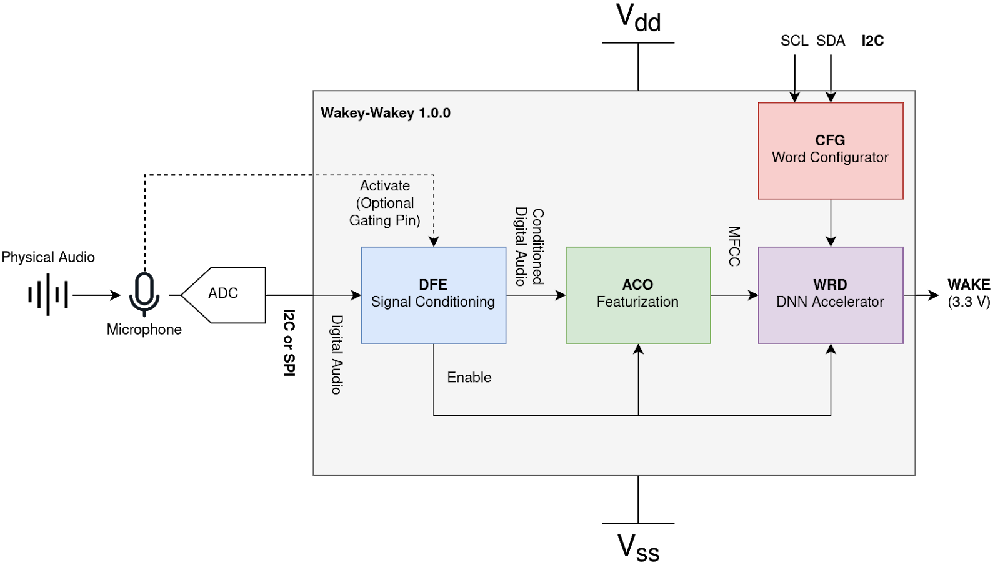

# Wakey-Wakey

## A Low-Power Reconfigurable Wake Word Accelerator

## Special Note for 2021-04-30 RTL Submission:

As of 2021-04-30, we've accomplished a great deal. We've managed to design and
verify a fully custom DNN accelerator for our DNN architecture, tested directly
against a Python model that we have created and quantized ourselves. Targeting
the toughest and riskiest part of our design first was a deliberate decision.

We've managed to achieve > 95% test accuracy with our model on detecting the
word "Yes" against noise and other words like "No" with just around an hour's
worth of training data. Furthermore, we've implemented this whole model in
RTL and using `cocotb`'s ability to run testbenches directly with Python, it's
been a breeze to directly compare our RTL results to the actual Python model
and verify functionality.

We've then reached out to Vesper, a microphone manufacturer specializing in
low-power microphones that activate upon voice activity for samples and received
them as of two days ago. We're excited to work on our microphone interface
by using an FPGA to direcly test our PDM interface to our microphone samples.

That being said, we still have a few tasks ahead, namely finishing the RTL
implementation of our acoustic featurization pipeline, completing the PDM
microphone interface, and adding in a shim layer between Caravel's wishbone
interface and our the reconfigurable memories in our design.

Overall however, we think we're on track to tapeout. We've already ran critical
parts of our design through OpenLANE (conv1d to GDS, wrd to LEF LVS) and we're
confident given the fully standard cell nature of our design that our PD process
will be straightforward.

Accomplished:
- Software modeling of our DNN architecture
- Trained DNN model and passed > 95% accuracy on hours-worth of training data
- Quantization of our DNN model
- Full RTL implementation of our DNN model
- Verification of DNN RTL against software gold model
- Requested and received HW test board sample for our microphone
- Ran `conv1d` module end-to-end on the OpenLANE flow to GDS
- Ran full DNN accelerator, the `wrd` module, on the OpenLANE flow to LEF LVS
- Completed software model of our feature pipeline, quantized to integers

Things to Wrap Up in RTL:
- Implement microphone interface and verify on FPGA and test hardware
- Implement acoustic featurization pipeline in RTL
- Implement Caravel-Wishbone configuration interface for our configurable params

Submission Details
---
For your code submission deadline tomorrow please submit a document on canvas
with the commit hash we should look at in your code repository. At this commit
in your repo you should have:

1. A document in the repo listing all your blocks and a list of tests you ran on
   each block and at the top level.

    Please see `rtl/ARCHITECTURE.md` for a listing of all of our blocks and
    corresponding tests.

2. For analog blocks that were verified based on a plot, you should 1) provide
   all the scripts needed to reproduce that plot, 2) provide an image of what
   the plot should look like, 3) report what specs you verified with that plot.

    N/A - our design contains no analog blocks.

3. For digital blocks you should provide the scripts/makefiles to run each test,
   and document how we can replicate them. All tests must check the simulation
   versus a gold output, and print a PASS/FAIL status at the end.

    Please see `rtl/README.md` for instructions on running and interpreting
    our tests.

4. For all projects, a summary of the key design metrics you achieved and how
   they compare to your initial targets (similar to how you presented in your
   design reviews).

    Please see the [Metrics] section below

We will grade your submission based on:

    Completeness of your design

    Whether we are able to run your tests and replicate your results

    How good/comprehensive your the tests are

    Quality of your documentation (all documentation should be in the repo)

## Table of Contents

- [Overview](#overview)
- [Metrics](#metrics)
- [References](#references)
- [Architecture](#architecture)
- [Contributors](#contributors)

## Overview

Wakey-Wakey is being built in Stanford University's EE272B: Design Projects in
VLSI Systems II.

It is expected to be submitted for tapeout in June 2021 as part of
Skywater Foundry's SKY130 MPW-TWO shuttle program.

Packaged die are expected to be received by December 2021.

### Structure
The project is structured as follows:

- `img` contains images for use in documentation throughout the project

- `py` contains software models in Python for our acoustic featurization
   pipeline and DNN accelerator

- `rtl` contains RTL source files and associated testbenches. Further details on
   RTL architecture and running the testbenches can be found in this repo.

## Metrics

TODO
Metrics were gathered as of 2021-04-30

### Area

### Timing

### Power

### Accuracy

## Architecture

## References

[Project Proposal](https://docs.google.com/document/d/17Ahc0jS1TsNaqgZagLtGwdKn3h2x0l6fPzC-cuKEdq0/edit?usp=sharing)

## Contributors
- [Eldrick Millares (@eldrickm)](https://github.com/eldrickm)
- [Matthew Pauly (@mjpauly)](https://github.com/mjpauly)
