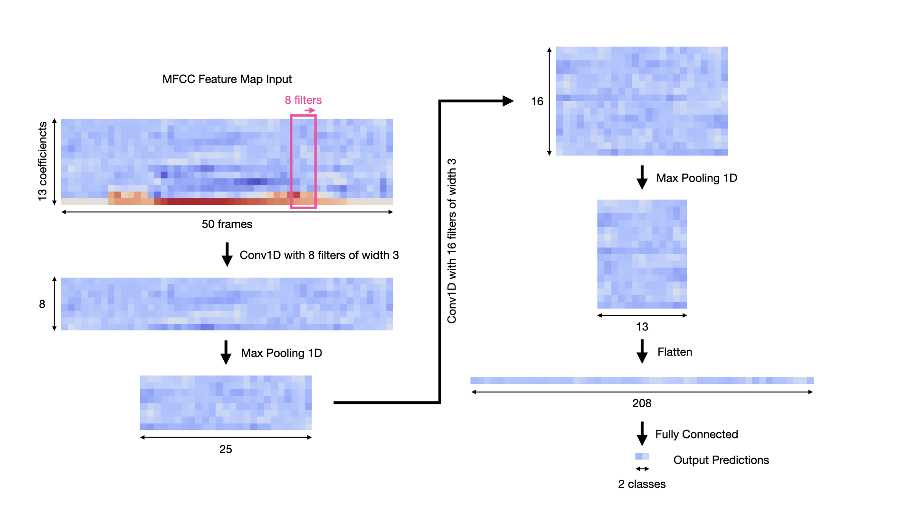

# WRD Architecture

WRD is our custom DNN accelerator for wake word detection after acoustic
featurization. It implements in hardware a specific network architecture
selected due to its small size and accuracy on one-second MFCC feature inputs.

## Model Architecture

The model architecture implemented consists of two conv layers, then one fully-
connected layer, yielding two output classes: the wake word and anything else.
The input is one-second of MFCC featurized audio data, split into 50 frames.
Each frame consists of 13 int8 coefficients. The flow of the activations through
the model are as shown in the following diagram:

## RTL Architecture

The RTL consists of the following blocks, with sub-blocks shown nested beneath
the top level block:
- wrd
    - zero\_pad
    - conv\_top
        - recycler
        - conv\_mem
        - vec\_mul
        - vec\_add
        - red\_add
        - relu
        - quantizer
    - max\_pool
    - conv\_sipo (serial in parallel out)
    - fc\_top
        - fc\_mem
        - mac
    - argmax
    - wake

Dataflow through each top-level processing blocks:

### Input

Input MFCC features are packed into 13\*8-bit vectors of which there are 50 of.
Each vector (frame) is fed into WRD sequentially.

### Output

The output of WRD is a single wake pulse which sustains for a set number of
clock cycles if the wake word is detected.

### Data Interfaces

We use a simple streaming scheme for sending data between blocks in WRD. The
signals consists of `data`, `valid`, `last`, and `ready`. The first three are
provided by the upstream block and the last is provided by the downstream block.
Generally we don't adhere strictly to the ready/valid protocol, as most blocks
are not sensitized to the downstream `ready` signal.

### Hardware Implementation

The following is a diagram showing the hardware implementation of the
`conv_top`, `conv_sipo`, and `fc_top` blocks in terms of basic processing
elements such as registers, muxes, multipliers, and adders.

## Tests

Each block's sub-directory contains a python file named `test_[blkname].py`
which defines the test bench. The tests can be run by invoking `make` without
arguments. See the README in the parent directory for instructions on dependency
setup.

### wrd

Our most comprehensive test is the top level test bench in `wrd/`. This test
exercises the entire WRD module with random inputs and real MFCC features, and
checks the outputs of both `conv_top` blocks, the `fc_top` block, and the `wake`
block against our gold model in `wakey_wakey/py/numpy_arch.py`. The random
inputs span the full range of int8 and int32 values. The MFCC features are
selected randomly from the hour's worth of model training data. We suggest
running this test in particular to verify WRD functionality.

### conv\_top

`conv_top`'s test bench verifies its output against random inputs as well as the
gold model. Since the `wrd` test bench already checks the outputs of both
`conv_top`s, its test coverage is not any greater than `wrd` alone.

### Other Blocks

All of the remaining RTL blocks have simpler test benches which do not check
DUT output against the gold model. For brevity they are not all elaborated upon
here.
