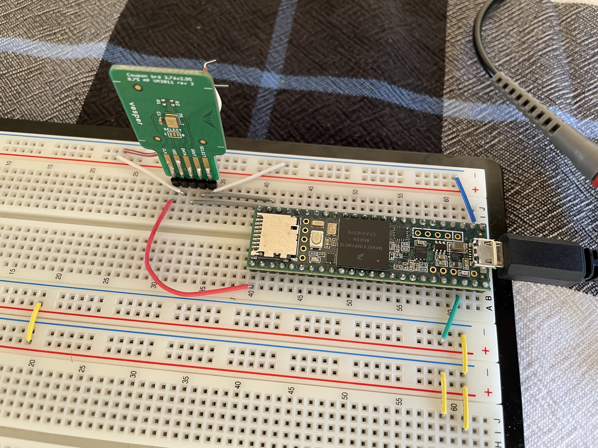

# PDM Capture Test

Teensy 3.6 code for capturing PDM data from a Vesper VM3011. Used to verify
the PDM processing pipeline.

Written for 2MHz or 4MHz PDM sampling. Samples are stored in the Teensy's RAM
until 1600000 samples are captured, then the samples are written to Serial to
be captured by the host computer. This results in audio captures that are 800ms
and 400ms long for 2MHz and 4MHz sampling respectively.

To capture data on the host computer, run:

```
cat [serial device] > py/out.bin
```

### Hardware Setup



### Processing

Run `py/parse_pdm_data.py` to process the PDM bitstream into .wav files that can
be listened to.
